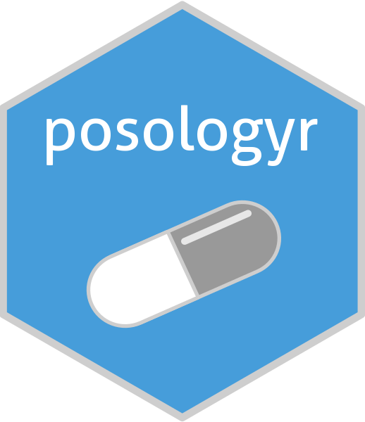

<!-- README.md is generated from README.Rmd. Please edit that file -->

```{r, include = FALSE}
knitr::opts_chunk$set(
  collapse = TRUE,
  comment = "#>",
  fig.path = "man/figures/README-",
  out.width = "100%"
)
```

# posologyr [](https://github.com/levenc/posologyr/)

<!-- badges: start -->
[](https://github.com/levenc/posologyr/actions)
<!-- badges: end -->

## Overview

`posologyr` is an R package for drug treatment individualisation, taking advantage of population pharmacokinetics (ppk), patient characteristics, and the results of therapeutic drug monitoring.

`posologyr` provides functions for estimating the pharmacokinetic (PK) parameters:

+ `poso_simu_pop()` for estimating the a priori distributions of ppk parameters by Monte-Carlo simulations
+ `poso_estim_map()` for computing the Maximum A Posteriori (MAP), aka Empirical Bayes Estimates (EBE), of individual PK parameters from the results of therapeutic drug monitoring
+ `poso_estim_mcmc()` for estimating the posterior distributions of individual PK parameters by Markov Chain Monte Carlo (MCMC)

Functions for dosage optimisation are included in `posologyr`:

+ `poso_dose_auc()` estimates the optimal dose to reach a target AUC
+ `poso_dose_conc()` estimates the optimal dose to reach a target concentration at any given time
+ `poso_time_cmin()` computes the time needed to reach a target trough concentration (Cmin)
+ `poso_inter_cmin()` estimates the optimal inter-dose interval to reliably achieve a target Cmin between each administration 

`posologyr` takes advantage of the simulation framework provided by the [RxODE](https://github.com/nlmixrdevelopment/RxODE) package.

## Installation

You can install the development version of `posologyr` from [GitHub](https://github.com/) with:

``` r
# install.packages("devtools")
devtools::install_github("levenc/posologyr")
```

## Examples

Examples of dosage adjustment with posologyr are available in the following vignettes: 

* `vignette("case_study_amikacin")`
* `vignette("case_study_vancomycin")`

All the vignettes are also available at [https://levenc.github.io/posologyr/](https://levenc.github.io/posologyr/).

## Acknowledgments
`posologyr`'s estimation functions were based on [Marc Lavielle's shiny app]( http://shiny.webpopix.org/mcmc/bayes1/)
