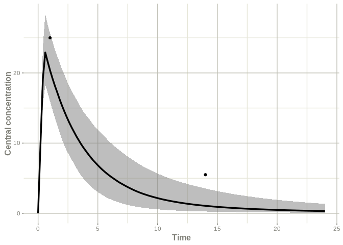
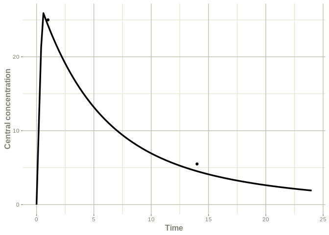
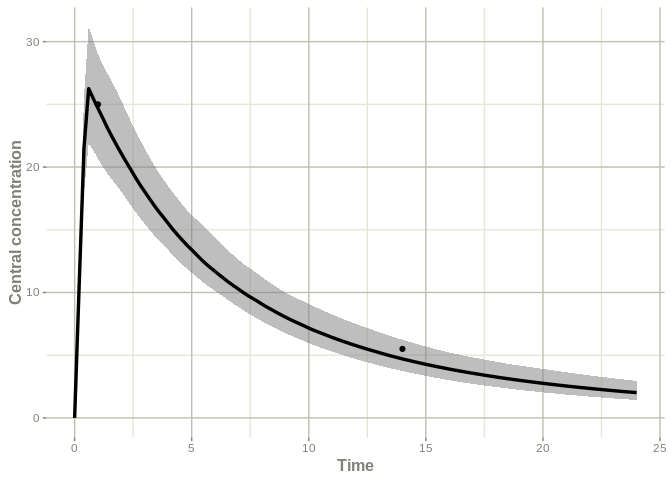

<!-- README.md is generated from README.Rmd. Please edit that file -->

# posologyr

<!-- badges: start -->

<!-- badges: end -->

## Overview

`posologyr` is an R package for drug treatment individualisation, taking
advantage of population pharmacokinetics (popPK), patient
characteristics, and the results of therapeutic drug monitoring.

`posologyr` provides functions for estimating the pharmacokinetic (PK)
parameters:

  - `poso_simu_pop()` for estimating the a priori distributions of popPK
    parameters by Monte-Carlo simulations
  - `poso_estim_map()` for computing the Maximum A Posteriori (MAP), aka
    Empirical Bayes Estimates (EBE), of individual PK parameters from
    the results of therapeutic drug monitoring
  - `poso_estim_mcmc()` for estimating the posterior distributions of
    individual PK parameters by Markov Chain Monte Carlo (MCMC)

Functions for dosage optimisation are included in `posologyr`:

  - `poso_time_cmin()` time needed to reach a target trough
    concentration (Cmin)
  - `poso_dose_auc()` optimal dose to reach a target AUC
  - `poso_dose_ctime()` optimal dose to reach a target concentration at
    any given time

Posologyr requires a popPK model written in the `RxODE` mini-language.

## Installation

You can install the development version of `posologyr` from
[GitHub](https://github.com/) with:

``` r
# install.packages("devtools")
devtools::install_github("levenc/posologyr")
```

## Example

This example of bayesian dosage adaptation is based on a fictitious
popPK model of tobramycin, and data of therapeutic drug monitoring.

Patient data (here: Michel’s lab results) are organised in a dataframe
following RxODE conventions.

``` r
library(posologyr)

df_michel <- data.frame(ID=1,TIME=c(0.0,0.5,1.0,14.0),
                        DV=c(NA,NA,25.0,5.5),
                        AMT=c(1000,-1000,0,0),
                        EVID=c(10102,10102,0,0),
                        DUR=c(0.5,0.5,NA,NA),
                        CLCREAT=80,WT=65)
df_michel
#>   ID TIME   DV   AMT  EVID DUR CLCREAT WT
#> 1  1  0.0   NA  1000 10102 0.5      80 65
#> 2  1  0.5   NA -1000 10102 0.5      80 65
#> 3  1  1.0 25.0     0     0  NA      80 65
#> 4  1 14.0  5.5     0     0  NA      80 65
```

TIME is in hours, AMT is a rate in milligram/hour for the zero-order
infusion of duration 0.5 hours: 500 mg of tobramycin are administered
over 30 minutes.

The sample tobramycin prior model is supplied with `posologyr`.
Following the same structure, user-defined models can be added.

The `load_ppk_model()` function initialises the objects to be used by
`posologyr`.

``` r
load_ppk_model(mod_tobramycin_2cpt_fictional,df_michel)
#>  Full model + prior information loaded as prior_ppk_model 
#>  Solved model created as solved_ppk_model 
#>  Dataset loaded as dat_posologyr
```

The estimates of the fixed effects parameters are available from the
prior model.

``` r
prior_ppk_model$pk_prior$psi
#>  THETA_ke   THETA_V THETA_k12 THETA_k21 
#>     0.210    19.800     0.041     0.120
```

The MAP estimates of the individual ETAs and PK parameters can be
computed easily.

``` r
poso_estim_map()
#> [[1]]
#>     eta_ke      eta_V    eta_k12    eta_k21 
#> -0.6828811 -0.0663349  0.0000000  0.0000000 
#> 
#> [[2]]
#> ▂▂▂▂▂▂▂▂▂▂▂▂▂▂▂▂▂▂▂▂▂▂▂▂▂▂▂▂▂▂ Solved RxODE object ▂▂▂▂▂▂▂▂▂▂▂▂▂▂▂▂▂▂▂▂▂▂▂▂▂▂▂▂▂
#> ── Parameters ($params): ───────────────────────────────────────────────────────
#>   THETA_ke    CLCREAT         WT    THETA_V  THETA_k12  THETA_k21     eta_ke 
#>  0.2100000 80.0000000 65.0000000 19.8000000  0.0410000  0.1200000 -0.6828811 
#>      eta_V 
#> -0.0663349 
#> ── Initial Conditions ($inits): ────────────────────────────────────────────────
#>  centr periph    AUC 
#>      0      0      0 
#> ── First part of data (object): ────────────────────────────────────────────────
#> # A tibble: 2 x 13
#>    time  TVke   TVV TVk12 TVk21    ke     V   k12   k21    Cc centr periph   AUC
#>   <dbl> <dbl> <dbl> <dbl> <dbl> <dbl> <dbl> <dbl> <dbl> <dbl> <dbl>  <dbl> <dbl>
#> 1     1 0.249  19.5 0.041  0.12 0.126  18.2 0.041  0.12 24.3  442.    13.8  19.3
#> 2    14 0.249  19.5 0.041  0.12 0.126  18.2 0.041  0.12  4.52  82.3   46.4 162. 
#> ▂▂▂▂▂▂▂▂▂▂▂▂▂▂▂▂▂▂▂▂▂▂▂▂▂▂▂▂▂▂▂▂▂▂▂▂▂▂▂▂▂▂▂▂▂▂▂▂▂▂▂▂▂▂▂▂▂▂▂▂▂▂▂▂▂▂▂▂▂▂▂▂▂▂▂▂▂▂▂▂
```

An optimal dose can be estimated to reach a concentration of 30 mg/l
half an hour after the end of the infusion.

``` r
poso_dose_ctime(time_c = 1,duration = .5,target_conc = 30)
#> [1] 618.2356
```

To further optimise the dosage, the time needed to reach a Cmin \< 0.5
mg/l after an infusion of 620 mg over 30 minutes can be estimated.

``` r
poso_time_cmin(dose = 620, duration = 0.5, target_cmin = 0.5)
#> [1] 45.6
```

As a result, the administration of 620 mg every 48 hours can be
advisable for Michel.

## Sample plots

The RxODE models can be used to plot the individual PK profile.

``` r
library(ggplot2)

# compute the population and individual PK parameters
pop_pk              <- poso_simu_pop()[[2]]
indiv_pk_map        <- poso_estim_map()[[2]]
indiv_pk_mcmc       <- poso_estim_mcmc()[[2]]

# add sampling times
pop_pk$time         <- seq(0,24,by=0.2)
indiv_pk_map$time   <- seq(0,24,by=0.2)
indiv_pk_mcmc$time  <- seq(0,24,by=0.2)

# get the individual observations from df_michel
indiv_obs           <- dat_posologyr[,c("DV","TIME")]
```

Plot the distribution of the prior population PK profiles + individual
observations.

``` r
names(indiv_obs)    <- c("eff","time")

plot(confint(pop_pk,"Cc", level=0.95),
     ylab="Central concentration") +
ggplot2::geom_point(data=indiv_obs, na.rm=TRUE)
#> ! in order to put confidence bands around the intervals, you need at least 2500 simulations
#> summarizing data...done
```



Plot the individual MAP PK profile + individual observations.

``` r
names(indiv_obs)    <- c("value","time")

plot(indiv_pk_map,Cc) + 
  ggplot2::ylab("Central concentration") +
  ggplot2::geom_point(data=indiv_obs, na.rm=TRUE)
```



Plot the distribution of the individual PK profiles + individual
observations.

``` r
names(indiv_obs)    <- c("eff","time")

plot(confint(indiv_pk_mcmc,"Cc", level=0.95),
     ylab="Central concentration") +
ggplot2::geom_point(data=indiv_obs, na.rm=TRUE)
#> ! in order to put confidence bands around the intervals, you need at least 2500 simulations
#> summarizing data...done
```



## Acknowledgments

`posologyr` takes advantage of the simulation framework provided by the
[RxODE](https://github.com/nlmixrdevelopment/RxODE) package.

`posologyr`’s estimation functions were based on [Marc Lavielle’s shiny
app](http://shiny.webpopix.org/mcmc/bayes1/)
