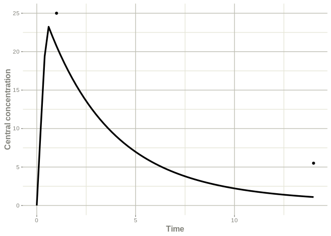
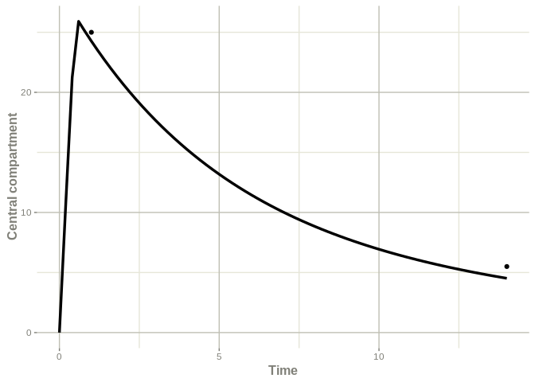
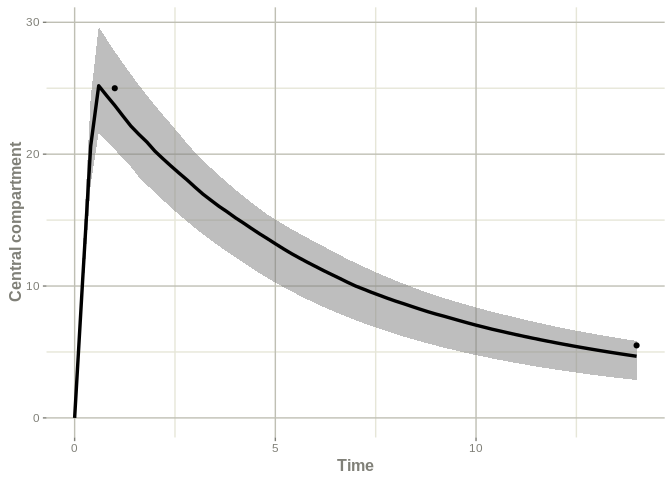

<!-- README.md is generated from README.Rmd. Please edit that file -->

# posologyr

<!-- badges: start -->

<!-- badges: end -->

## Overview

The goal of posologyr is to provide free tools (as in free speech) to
individualize drug treatments by taking advantage of population
pharmacokinetics, patient characteristics, and the results of
therapeutic drug monitoring.

Posologyr offers functions for estimating pharmacokinetic parameters:

  - Estimation of the a priori distribution of the population
    pharmacokinetic parameters by Monte-Carlo simulations
  - Estimation of individual parameters Maximum A Posteriori (MAP), or
    Empirical Bayes Estimates (EBE), from the results of therapeutic
    drug monitoring
  - Estimation of the posterior distribution of individual
    pharmacokinetic parameters by Markov Chain Monte Carlo (MCMC)

Posologyr offers dosage optimisation functions based on estimated
parameters:

  - Determination of the time needed to reach a target trough
    concentration (Cmin)
  - Determination of the optimal dose to reach a target AUC
  - Determination of the optimal dose to reach a target concentration at
    any given time

Posologyr requires a population pharmacokinetic model written in the
specific language of RxODE, with an exponential model of
inter-individual variability.

## Installation

You can install the development version of posologyr from
[GitHub](https://github.com/) with:

``` r
# install.packages("devtools")
devtools::install_github("levenc/posologyr")
```

## Example

This example of Bayesian dosage adaptation is based on a fictitious
population pharmacokinetic model of tobramycin, and data of therapeutic
drug monitoring.

Patient data (here: Michel’s results) should be organised in a dataframe
that follows RxODE (or NONMEM) conventions.

``` r
library(posologyr)

df_michel <- data.frame(ID=1,TIME=c(0.0,0.5,1.0,14.0),DV=c(NA,NA,25.0,5.5),AMT=c(1000,-1000,0,0),EVID=c(10102,10102,0,0),DUR=c(0.5,0.5,NA,NA),CLCREAT=80,WT=65)
df_michel
#>   ID TIME   DV   AMT  EVID DUR CLCREAT WT
#> 1  1  0.0   NA  1000 10102 0.5      80 65
#> 2  1  0.5   NA -1000 10102 0.5      80 65
#> 3  1  1.0 25.0     0     0  NA      80 65
#> 4  1 14.0  5.5     0     0  NA      80 65
```

Here the TIME is in hours. Following the RxODE conventions, the AMT is a
rate in milligram/hour for the zero-order infusion of duration 0.5
hours. In this example 500 mg of tobramycin are administered over 30
minutes.

The tobramycin sample model is supplied with posologyr. It is a list of
elements that includes all the necessary information, such as the
structural model, the required covariates, and the variance covariance
matrix.

Following the same structure, new models can be implemented.

``` r
# Residual error model
error_model_comb1 <- function(f,xi){
 g <- xi[1] + xi[2]*f
 return(g)
}

# Fictionnal tobramycin 2cpt: example
mod_tobramycin_2cpt_fictionnal <- list(
  description = c("Fictionnal tobramycin model for test purposes,
                  based on
  https://www.page-meeting.org/pdf_assets/1954-2017_05_01_poster_Tobramycin.pdf"),
  reference = NULL,
  ppk_model   = RxODE::RxODE({
    centr(0) = 0
    ke = TVke*(CLCREAT/67.8)^0.89*(WT/66.4)^-1.09
    V  = TVV*(WT/66.4)^0.80
    Cc  = centr/V;
    d/dt(centr)  = - ke*centr - k12*centr + k21*periph;
    d/dt(periph) =            + k12*centr - k21*periph;
    d/dt(AUC)    =   Cc;
  }),
  error_model = error_model_comb1,
  pk_prior    = list( name = c('TVke','TVV','k12','k21'),
                      reference = c(TVke=0.21, TVV=19.8, k12=0.041, k21=0.12),
                      Omega = matrix(c(0.08075, 0      ,  0, 0,
                                       0      , 0.01203,  0, 0,
                                       0      , 0      ,  0, 0,
                                       0      , 0      ,  0, 0),
                                     ncol=4,byrow=TRUE)),
  covariates  = c("CLCREAT","WT"),
  xi          = c(additive_a = 0, proportional_b = 0.198))
#> qs v0.23.6.
```

The load\_ppk\_model() function initialises the objects to be used by
posologyr.

``` r
load_ppk_model(mod_tobramycin_2cpt_fictionnal,df_michel)
#>  Full model + prior information loaded as prior_ppk_model 
#>  Solved model created as solved_ppk_model 
#>  Dataset loaded as dat_posology
```

The typical values of the population parameters are available in the
prior model

``` r
prior_ppk_model$pk_prior$reference
#>   TVke    TVV    k12    k21 
#>  0.210 19.800  0.041  0.120
```

The MAP estimates of the individual parameters can be computed easily

``` r
poso_estim_map()
#>       TVke        TVV        k12        k21 
#>  0.1061009 18.5283373  0.0410000  0.1200000
```

One can then plot:

``` r
#The typical population profile,with the individual covariates, 
#over the individual concentration observations.
poso_plot_pop()
```



``` r
#The individual Maximum A Posteriori prediction
#over the individual observations
poso_plot_map()
```



``` r
#The individual posterior distribution over the individual observations
poso_plot_mcmc() 
#> ! in order to put confidence bands around the intervals, you need at least 2500 simulations
#> summarizing data...done
```



The optimal dose can be estimated if, for example, a concentration of 30
mg/l is to be reached half an hour after the end of the infusion.

``` r
poso_dose_ctime(time_c = 1,duration = .5,target_ctime = 30)
#> [1] 618.2168
```

To further optimize the dosage, it is now possible to determine the time
needed to reach a Cmin \< 0.5 mg/l, after an infusion of 620 mg over 30
minutes.

``` r
poso_time_cmin(dose = 620, duration = 0.5, target_cmin = 0.5)
#> [1] 45.6
```

To conclude, the administration of 620 mg every 48 hours can be
advisable for Michel.

## Acknowledgments

Posologyr’s estimation functions were based on Marc Lavielle’s code
available at <http://shiny.webpopix.org/mcmc/bayes1/>

Posologyr relies heavily on the excellent RxODE package
