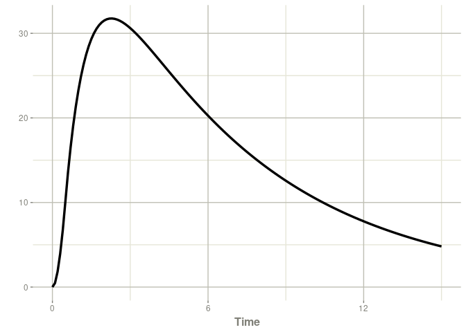

<!-- README.md is generated from README.Rmd. Please edit that file -->

# posologyr [](https://github.com/levenc/posologyr/)

<!-- badges: start -->

[](https://github.com/levenc/posologyr/actions/workflows/R-CMD-check.yaml)
[](https://CRAN.R-project.org/package=posologyr)
<!-- badges: end -->

## Overview

Personalize drug regimens using individual pharmacokinetic and
pharmacokinetic-pharmacodynamic profiles. Using combining therapeutic
drug monitoring (TDM) data and a population model, `posologyr` provides
accurate a posteriori estimates and allows you to compute the optimal
individualized dosing regimen.

`posologyr` provides the following functions for dosage optimization:

- `poso_dose_conc()` estimates the optimal dose to reach a target
  concentration at any given time
- `poso_dose_auc()` estimates the optimal dose to reach a target area
  under the concentration/time curve (AUC)
- `poso_time_cmin()` estimates the time needed to reach a target trough
  concentration (Cmin)
- `poso_inter_cmin()` estimates the optimal inter-dose interval to
  reliably achieve a target Cmin between each administration

Individual pharmacokinetic (PK) profiles can be estimated with or
without data from therapeutic drug monitoring (TDM):

- `poso_estim_map()` computes the Maximum A Posteriori Bayesian
  Estimates (MAP-BE) of the individual PK parameters from the results of
  TDM
- `poso_simu_pop()` samples from the the a priori distributions of PK
  parameters

`posologyr` takes advantage of the simulation framework provided by the
[rxode2](https://github.com/nlmixr2/rxode2) package.

## Installation

You can install the released version of `posologyr` from
[CRAN](https://CRAN.R-project.org) with:

``` r
install.packages("posologyr")
```

You can install the development version of `posologyr` from
[GitHub](https://github.com/) with:

``` r
# install.packages("remotes")
remotes::install_github("levenc/posologyr")
```

## Bayesian dosing example

To determine the optimal dose of gentamicin for a patient with
`posologyr`, you will need:

1.  A prior PK model, written in `rxode2` mini-language

In this example, a gentamicin PK from the literature
<doi:10.1016/j.ijantimicag.2003.07.010>

``` r
mod_gentamicin_Xuan2003 <- function() {
  ini({
    THETA_Cl  = 0.047
    THETA_V   = 0.28
    THETA_k12 = 0.092
    THETA_k21 = 0.071
    ETA_Cl  ~ 0.084
    ETA_V   ~ 0.003
    ETA_k12 ~ 0.398
    ETA_k21 ~ 0.342
    add_sd  <- 0.230
    prop_sd <- 0.237
  })
  model({
    TVl   = THETA_Cl*ClCr
    TVV   = THETA_V*WT
    TVk12 = THETA_k12
    TVk21 = THETA_k21
    
    Cl    = TVl*exp(ETA_Cl)
    V     = TVV*exp(ETA_V)
    k12   = TVk12*exp(ETA_k12)
    k21   = TVk21 *exp(ETA_k21)
    
    ke    = Cl/V
    Cp    = centr/V
    
    d/dt(centr)  = - ke*centr - k12*centr + k21*periph
    d/dt(periph) =            + k12*centr - k21*periph

    Cp ~ add(add_sd) + prop(prop_sd) + combined1()
  })
}
```

2.  A table of the patient’s TDM data, in a format similar to the data
    for NONMEM

``` r
patient_data <- data.frame(ID=1,
                           TIME=c(0.0,1.0,11.0),
                           DV=c(NA,9,2),
                           AMT=c(180,0,0),
                           DUR=c(0.5,NA,NA),
                           EVID=c(1,0,0),
                           ClCr=38,
                           WT=63)
patient_data
#>   ID TIME DV AMT DUR EVID ClCr WT
#> 1  1    0 NA 180 0.5    1   38 63
#> 2  1    1  9   0  NA    0   38 63
#> 3  1   11  2   0  NA    0   38 63
```

### Individual PK profile

With these two elements, you can estimate and plot and the individual
concentrations over time.

``` r
library("posologyr")
```

``` r
patient_map <- poso_estim_map(patient_data,mod_gentamicin_Xuan2003)
#> using C compiler: ‘gcc (Ubuntu 11.4.0-1ubuntu1~22.04) 11.4.0’
plot(patient_map$model,Cc)
```



### Dose optimization

We will optimize the gentamicin dosage for this patient to meet two
criteria:

- A peak concentration of 12 mg/L, 30 minutes after a 30-minute
  infusion.
- A trough concentration of less than 0.5 mg/L.

The time required to reach a residual concentration of 0.5 mg/L can be
estimated as follows:

``` r
poso_time_cmin(patient_data,mod_gentamicin_Xuan2003,tdm=TRUE,
               target_cmin = 0.5)
#> using C compiler: ‘gcc (Ubuntu 11.4.0-1ubuntu1~22.04) 11.4.0’
#> $time
#> [1] 44.9
#> 
#> $type_of_estimate
#> [1] "point estimate"
#> 
#> $cmin_estimate
#> [1] 0.4991313
#> 
#> $indiv_param
#>   THETA_Cl THETA_V THETA_k12 THETA_k21 add_sd prop_sd     ETA_Cl       ETA_V
#> 3    0.047    0.28     0.092     0.071   0.23   0.237 0.03701064 0.001447308
#>      ETA_k12     ETA_k21 ClCr WT
#> 3 0.08904703 -0.04838898   38 63
```

The dose required to achieve our target concentration can then be
determined for an infusion at H48.

``` r
poso_dose_conc(patient_data,mod_gentamicin_Xuan2003,tdm=TRUE,
               target_conc = 12,duration=0.5,time_dose = 48,time_c = 49)
#> $dose
#> [1] 237.5902
#> 
#> $type_of_estimate
#> [1] "point estimate"
#> 
#> $conc_estimate
#> [1] 12
#> 
#> $indiv_param
#>   THETA_Cl THETA_V THETA_k12 THETA_k21 add_sd prop_sd     ETA_Cl       ETA_V
#> 3    0.047    0.28     0.092     0.071   0.23   0.237 0.03701052 0.001447305
#>      ETA_k12     ETA_k21 ClCr WT
#> 3 0.08904752 -0.04838936   38 63
```

In conclusion a dose of 240 mg 48 h after the first injection would be
appropriate to meet our 2 criteria.

More examples can be found at: <https://levenc.github.io/posologyr/>

## Performance of the MAP-BE algorithm in posologyr

`posologyr` showed comparable performance to NONMEM MAP estimation with
option `MAXEVAL=0`:

- Pharmaceutics **2022**, 14(2), 442;
  [doi:10.3390/pharmaceutics14020442](https://doi.org/10.3390/pharmaceutics14020442)
- Supporting data: <https://github.com/levenc/posologyr-pharmaceutics>
